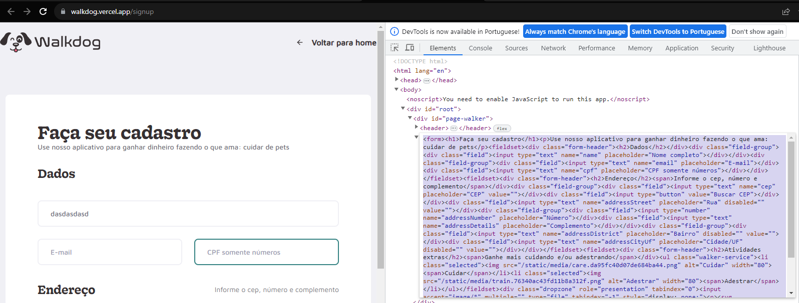

# Testes automatizados com ChatGPT em Robot Framework

# Objetivo

O objetivo deste projeto de automação de testes em [Robot Framework], é utilizar o [ChatGPT] para criar cenários de testes automatizados, para o cadastro de *dog walker* no site [Walk dog].

# Especificações
- A versão utilizada do Robot foi a 6.1.1
- A versão utilizada do Python foi a 3.11.5
- A versão utilizada do Pip foi a 23.2.1
- A versão utilizada do [ChatGPT] foi a 3.5 (gratuita).
- Os conhecimentos utilizados nesse projeto foram obtidos do curso [AutomatizAi - Robot Framework e ChatGPT] fornecido pelo [Fernando Papito]

# Como foram criados os testes?

A construção do projeto foi feita em 3 etapas:

## Etapa 1 - Gerar tabela de seletores css
Foi **copiado o HTML** relacionado ao form de cadastro de walk dog, no site [Walk dog]

Este HTML foi utilizado para solicitar ao ChatGPT que gerasse uma tabela contendo os seletores dos principais campos distríbuidos na página.

- No arquivo [request_1](./chatGPT/request1/input.md) podemos visualizar a solitiação feita ao ChatGPT.
- No arquivo [answer_1](./chatGPT/request1/answer.md) podemos visualizar a resposta obtida, contendo a tabela com os seletores.

## Etapa 2 - Gerar testes automatizados
No arquivo [request_2](./chatGPT/request2/input.md) podemos visualizar a solicitação da criação de testes automatizados em Robot Framework, onde inputamos:
- Descrição da funcionalidade de cadastro de dog walker;
- tabela gerada na Etapa 1;
- Cenários de aceite escritos em Gherkin.

No arquivo [answer_2](./chatGPT/request2/answer.robot) podemos visualizar a resposta dada pelo ChatGPT contendo os cenários de testes automatizados em Robot.

## Etapa 3 - Ajustes para execução dos testes automatizados
Os testes gerados pelo ChatGPT representaram muito bem os cenários solicitados, mas, foram precisos pequenos ajustes para que eles pudessem ser executados corretamente.

### O que foi preciso alterar?
- Substituir `${URL}`: de http://www.walkdog.com para https://walkdog.vercel.app/signup
- Substituir `${DOCUMENT}`: de `path/to/document.png` para `${EXECDIR}/fixtures/document.png`
- Remover parâmetros do step `[Setup]     Abrir Navegador    ${URL}    ${BROWSER}`
  - `[Setup]     Abrir Navegador    ${URL}    ${BROWSER}` por `[Setup]     Abrir Navegador`
- Remover step `Vá Para a Página de Cadastro` pois o site já é aberto na página de cadastro
- Ajustar dados do step `Preencher Dados Pessoais` de acordo com minha preferência
  - preferi separar os dados ao invés de receber uma lista a iterar sobre ela
- Ajustar **keyword** `Preencher Dados Pessoais`
  - adicionar inserção dos campos número e complemento
- Substituir as palavras `For` e `And` por `FOR` e `AND` no step `Selecionar Atividades`
- Alterar seletor do botão submit: `css=input[type="button"]` por `css=button[type=submit]`
- Alterar seletor do popup onde é apresentado a mensagem de cadastro efetuado.
  - substituido o seletor `css=div.success-message` por `xpath=//div[@class="swal2-html-container"]`
- Alterar seletor do alert de campo obrigatório: de `css=div.alert-message` por `xpath=//span[@class="alert-error"][text()="${expected_text}"]`

No arquivo [cadastro.robot](./cadastro.robot) temos os testes automatizados, completamente funcionais, após os ajustes mencionados.

# Avaliação
Podemos identificar que o ChatGPT é um aliado para automação de testes, e que tem potencial para nos auxiliar nesse processo, minimizando nossos esforços.

[Robot Framework]: https://robotframework.org/
[ChatGPT]: https://chat.openai.com/
[Walk dog]: https://walkdog.vercel.app/signup
[AutomatizAi - Robot Framework e ChatGPT]: https://qaxperience.com/pt/meu-conteudo/curso/64dcd98cd6c17ce642520443/aula/64de9254d6c17ce64258a34d
[Fernando Papito]: https://www.linkedin.com/in/papitoio/